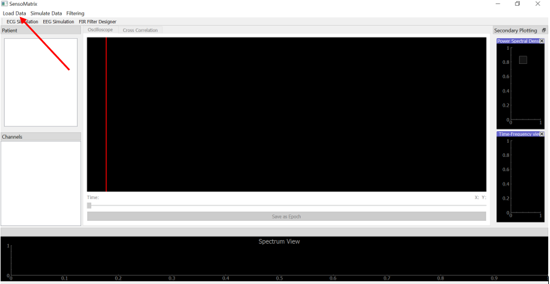
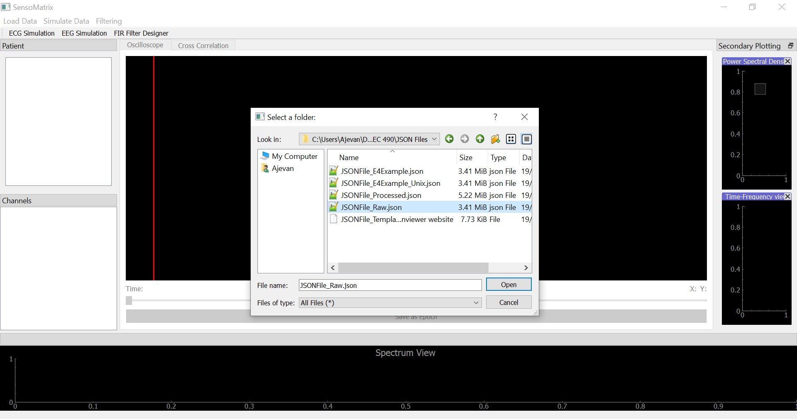
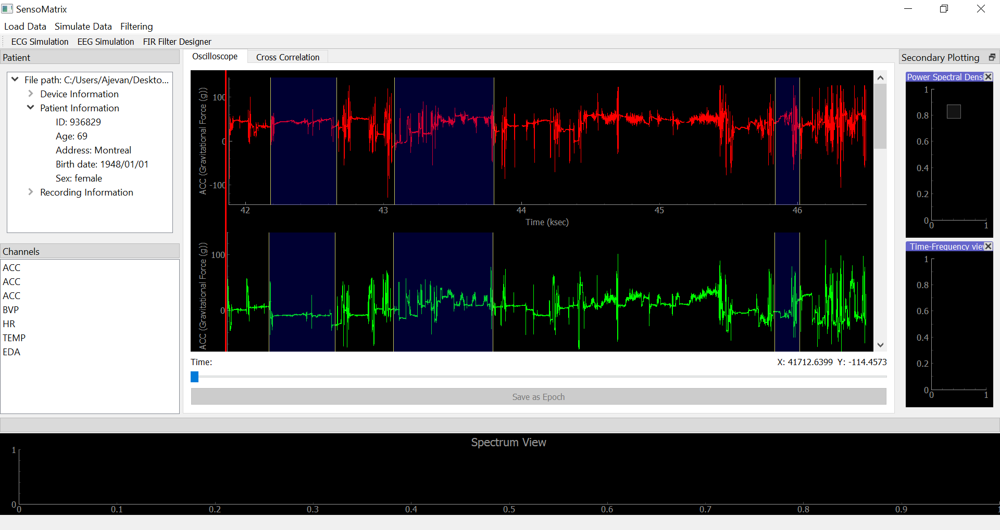
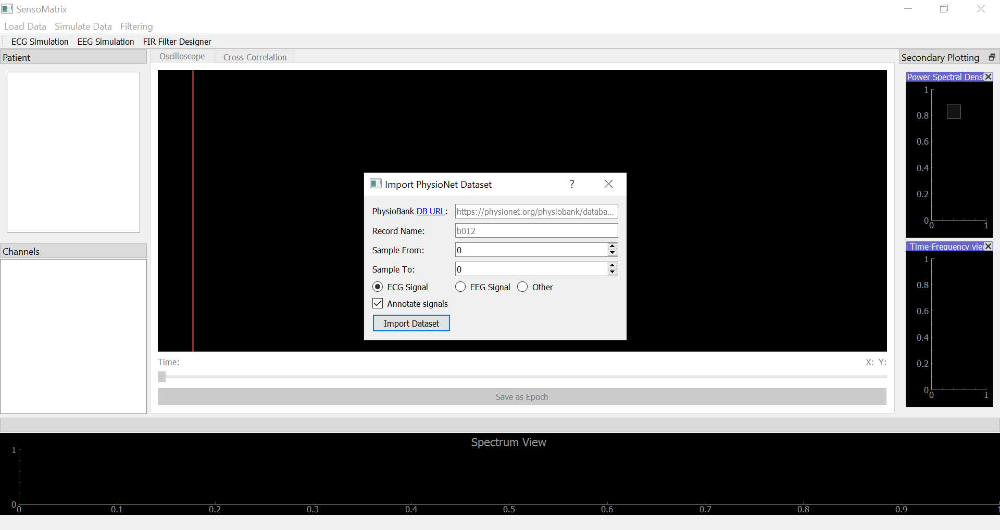
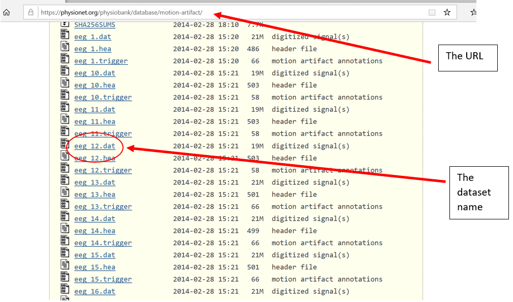
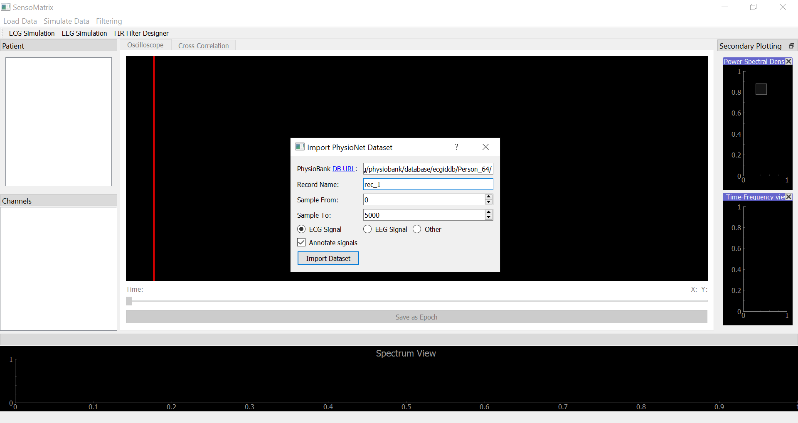
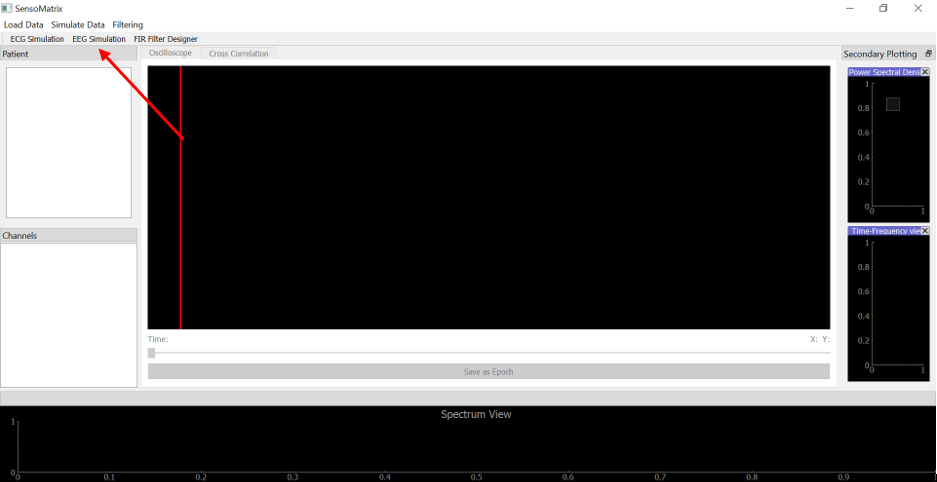
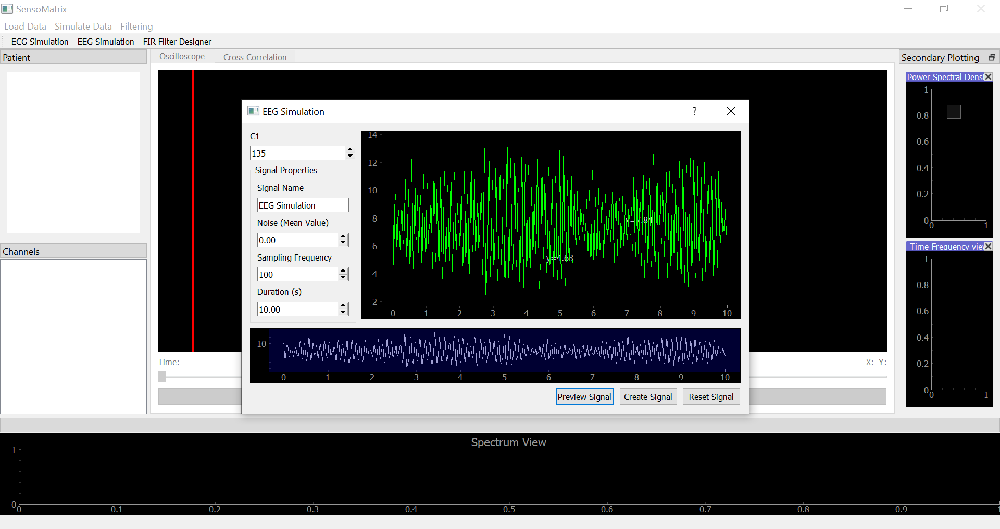

How To Load Data
================

How to load data from hard disk
-------------------------------

Note: Currently you can load the following file types assuming that each
follow their respective formats: \* .txt \* .json (`JSON Template`_) \*
.edf (from `Physionet`_) \* .fif (from `Physionet`_)

The .txt file should follow the following format:

%name of signal%

%type of signal%

%sampling rate of signal%

%list of time separated by commas%

%list of samples separated by commas%

*For Example:*

.. code:: text

   EEG Jansen
   eeg
   200
   0, 1, 2, 3, 4, 5, 6, 7, 8, 9, 10
   4, 6, 2, 9, 11, 1, 0, 4, 3, 12, 5

Step 1
~~~~~~

From the main screen, click on **Load data** at the top left corner and
click on **Locally**. |image0|

Step 2
~~~~~~

This will open the dialog to browse for the file on your computer.
Browse through your computer, select your input file, and click
**Open**. |image1|

Step 3
~~~~~~

Once the file is loaded onto the application, you should be able to see
the signal on the Oscilloscope, similar to the figure below. If the file
is a JSON file, then you would also see a few key patient information on
the left hand side. |image2|

How to load data from Physionet
-------------------------------

Physionet is an online database with several recorded biosignals
available to the public. *Note*: Internet connection is required.

.. _step-1-1:

Step 1
~~~~~~

From the main screen, click on **Load data** at the top left corner and
click on **PhysioNet**. |image3|

.. _step-2-1:

Step 2
~~~~~~

This will open the dialog similar to the figure below. You can click on
`DB URL`_ here or on the dialog to go to Physionet. |image4|

Navigate the site, and once you find a dataset of interest, *for
example* like that in the figure below. |image5|

*Copy* & *paste* the *URL* and dataset name into the dialog. Also,
choose from what sample to what sample you want to see. Choose the type
of the signal and check the box if you would like to see the
annotations. Then click on **Import dataset**. Once the dataset has been
loaded, it will be displayed on the Oscilloscope. |image6|

How to simulate your own data
-----------------------------

EEG Simulation
~~~~~~~~~~~~~~

.. _step-1-2:

Step 1
^^^^^^

Click on **EEG Simulation** at the top left hand side. |image7|

.. _step-2-2:

Step 2
^^^^^^

In the EEG Simulation dialog, you can set the various signal parameters,
such as *C1* (Jansen Model), signal name, noise, sampling frequency
(Note: Max 1KHz), and duration (Note: Min: 1 sec). You can click on
**Preview Signal** in order to see what the signal you have created
looks like. Once you are satisfied with your signal, click on **Create
Signal** to output the signal on the Oscilloscope. |image8|

ECG Simulation
~~~~~~~~~~~~~~

.. _step-1-3:

Step 1
^^^^^^

Click on **ECG Simulation** at the top left hand side. [](images/ecgSi

.. _JSON Template: jsonExample.rst
.. _Physionet: https://physionet.org/physiobank/database/
.. _DB URL: https://physionet.org/physiobank/database/

