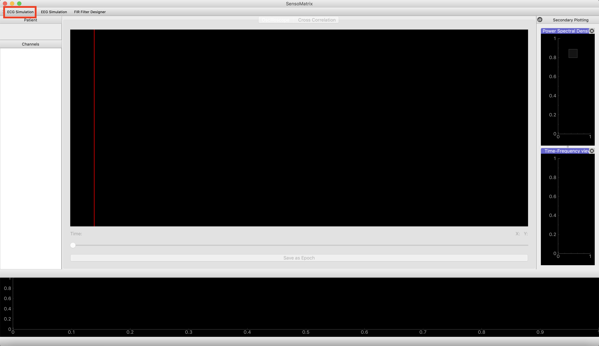
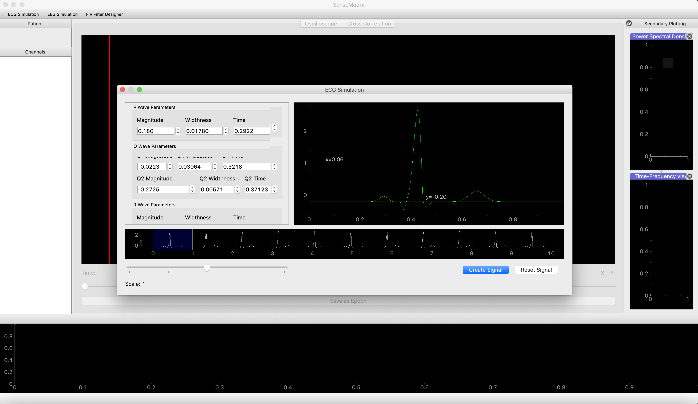
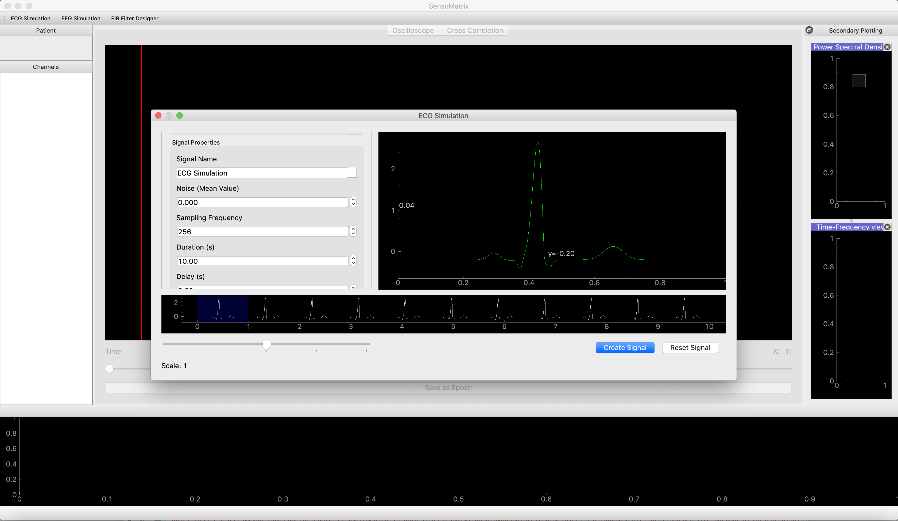
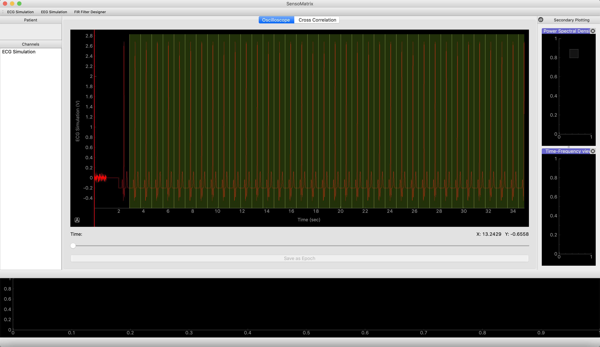
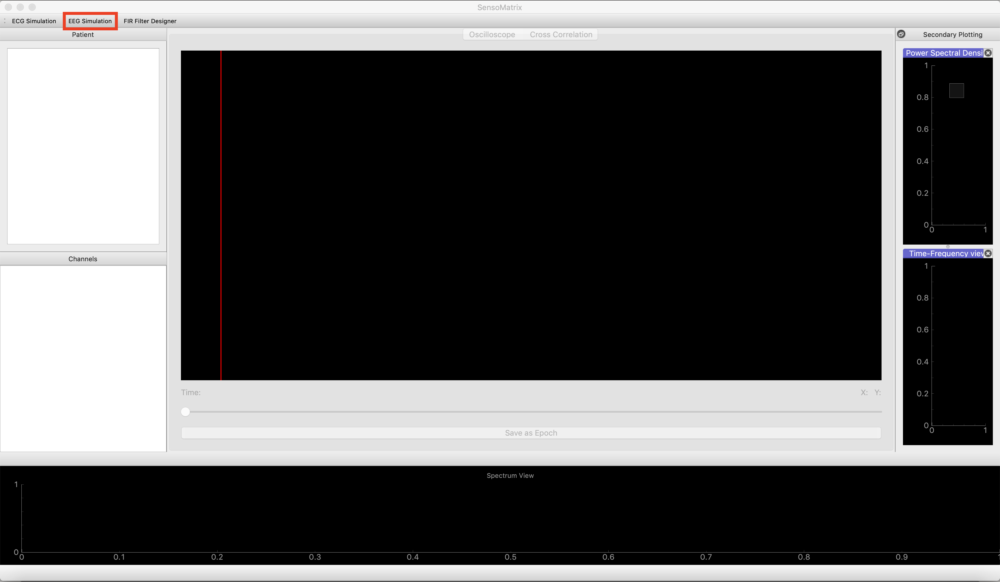
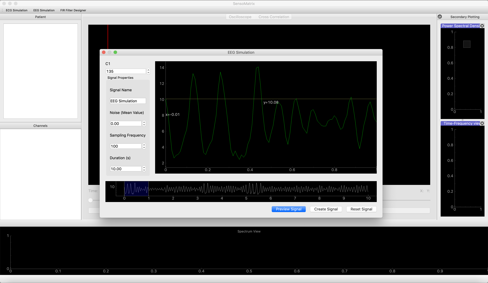
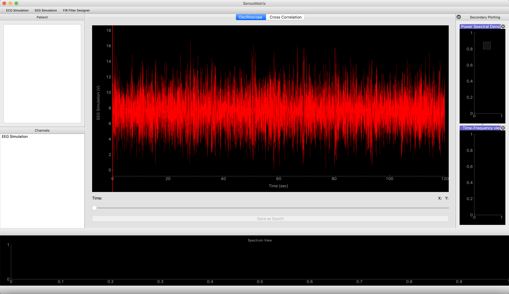

Simulate the ECG and EEG data
=============================

Simulating ECG data
-------------------

1. The user is required to select the ECG Simulation, which is situated
   at the top right of the SensoMatrix window. Screenshot provided
   below: |image0|
2. Once the ECG Simulation window is opened, the user will be able to
   configure the simulated signal. This will be done by changing the
   parameters of the P,Q,R,S and T wave, which are the main components
   of the ECG signal. In terms of these P,Q,R,S and T waves, there are
   corresponding magnitude, width and time. Screenshot provided below:
   |image1|

3. The user can also configure the signal properties, in a sense that it
   simulates a signal with added noise, or changing other parameters
   such as sampling frequency, period, total duration of the signal and
   to create a delay into the signal. The user can also change the
   signal name, in case they plan to work with multiple signals.
   Screenshot provided below: |image2|

Example of a simulated ECG signal with total duration: 120 secs, delay:
2 secs, and noise: 0.0045. |image3|

**The user can gain a complete understanding regarding how to simulate
ECG signal by referring to this
`link <https://www.academia.edu/1196836/SIMPLIFIED_MATHEMATICAL_MODEL_for_GENERATING_ECG_SIGNAL_and_FITTING_THE_MODEL_USING_NONLINEAR_LEAST_SQUARE_TECHNIQUE?auto=download>`__**

Simulating EEG data
-------------------

1. The user is required to select the EEG Simulation, which is situated
   at the top right of the SensoMatrix window. Screenshot provided
   below: |image4|

2. Once the EEG Simulation window is opened, the user will be able to
   configure the simulated signal. This will be done by changing the C1
   constant, which will dictate the brain wave that the signal will be
   presented as (e.g: alpha wave, beta wave and etc).\ **This C1
   constant is derived from the Jansen Model.** |image5|

3. The user can also configure the signal properties, in a sense that it
   simulates a signal with added noise, or changing other parameters
   such as sampling frequency, period, total duration of the signal and
   to create a delay into the signal. The user can also change the
   signal name, in case they plan to work with multiple signals.

Example of a simulated EEG signal with total duration: 120 secs and
noise: 1.00, with C1 constant: 135. |image6|

**The user can gain a complete understanding regarding how to simulate
EEG signal by referring to this
`link <http://www.elektrorevue.cz/en/download/modeling-of-the-eeg-signal/>`__**

