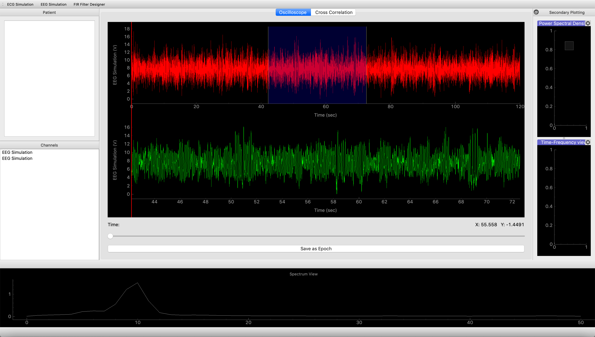
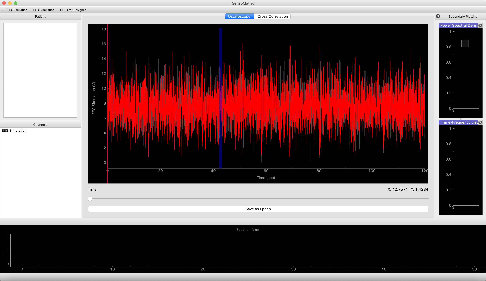
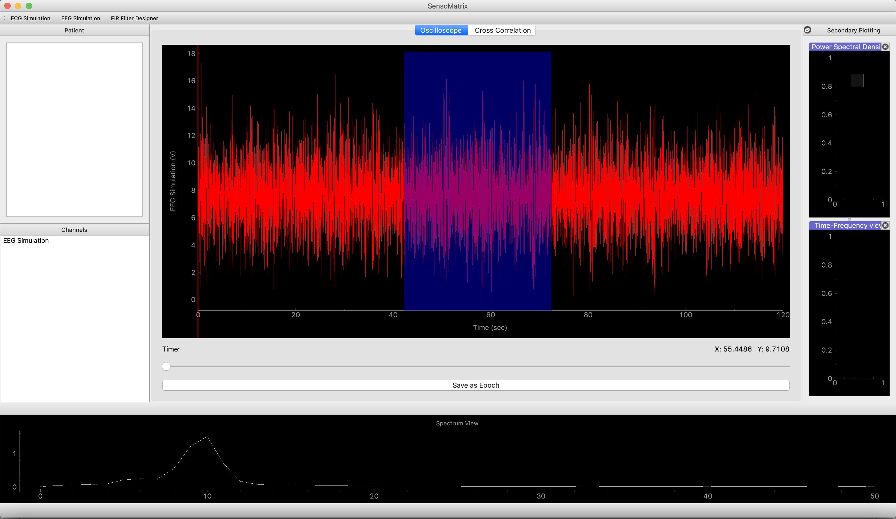
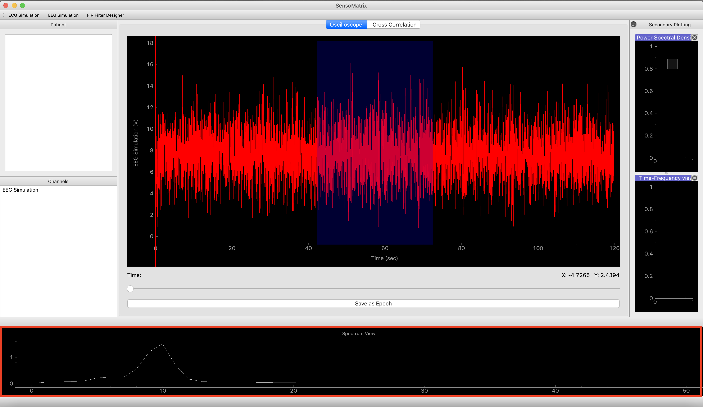
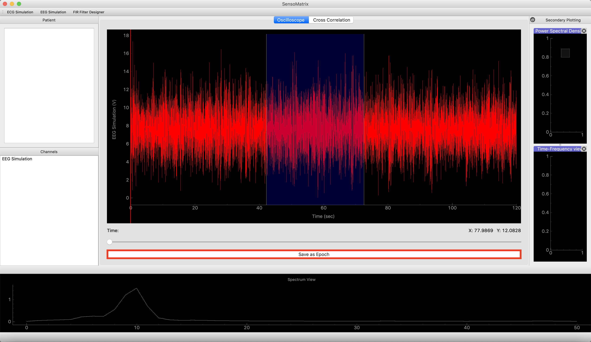

Tagging a window
================

In this scenario, the user is able to select a specific time frame
(window) from the ECG/EEG signal, in order to perform further analysis.

1. From the generated/received signal, the user must double click on a
   desired portion of the signal, for which he/she can properly analyze
   that portion of the signal. Once the desired portion has been
   double-clicked for further study, the user will see a blue highlight,
   to demonstrate the tagged window. Screenshot provided below: |image0|

2. The user may also expand or compress the tagged window size, by
   simply clicking and holding the edge of the window and dragging it
   along the time axis. Screenshot provided below: |image1|

3. The user may also move the tagged window along the time axis, in
   order to properly analyze the signal in different periods. This can
   be done by clicking on the tagged window and moving along the time
   axis.

4. The user may also have a spectrum view of the tagged window, by
   looking at the spectrum view, which is located at the bottom of the
   SensoMatrix window. Screenshot provided below: |image2|

5. The user can also further analyze the highlighted window, by saving
   it as an epoch, by clicking on "Save as Epoch" located right below
   the oscilloscope window. As a result, the user will see highlighted
   portion of the signal being displayed underneath the original signal.
   Screenshots provided below: |image3|

