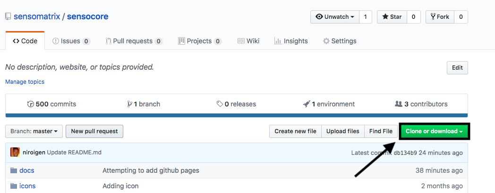
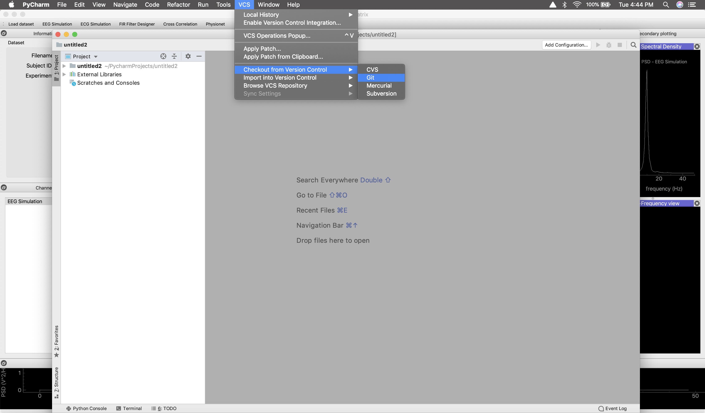
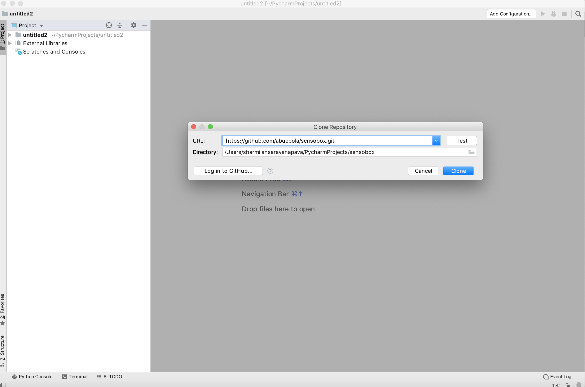

# Accessing SensoMatrix on Mac

# Prerequisites

1. You have to ensure that your system has git.

2. Open Terminal in Mac and copy paste this into the Terminal `/usr/bin/ruby -e "$(curl -fsSL https://raw.githubusercontent.com/Homebrew/install/master/install)` and press Enter.

3. Afterwards, you are required to run `brew install git`

4. Run the following commands, in order to configure it to your Git username and email
 `git config --global user.name "Your Name"`
 `git config --global user.email "youremail@example.com"`
 
 
# Using Terminal to access SensoMatrix on Mac

1. Go to [SensoMatrix](https://github.com/sensomatrix/sensocore) application on GitHub.

2. Once you followed the link above, you are required to click on the "clone or download" button which can be found in the top right. Screenshot provided below: 
 

3. Once clicked, you will have to clone the HTTPS by copying the HTTPS link provided. Screenshot provided below:
 

4. You will have to type in `cd` and click enter. Then type `git clone` followed by the URL that has been copied.

5. Finally, you can type in `ls` to see if the SensoMatrix is in the computer.

# Using PyCharm to access SensoMatrix on Mac

1. Go to [SensoMatrix](https://github.com/sensomatrix/sensocore) application on GitHub.

2. Once you followed the link above, you are required to click on the "clone or download" button which can be found in the top right. Screenshot provided below: 
 

3. Once clicked, you will have to clone the HTTPS by copying the HTTPS link provided. Screenshot provided below:
 

4. Now you will have to open [PyCharm](https://www.jetbrains.com/pycharm/download/#section=mac).

5. In PyCharm, you will have to go New Project.

6. Once you have opened a new project, you will have to go to "VCS" then go to "Checkout from Version Control" and then click on "Git". Screenshot provided below:
 

7. Once the above directions have been followed, there will be a new window that appears that is titled "Clone Repository", where you may paste the copied URL from GitHub. Screenshot provided below:
 

8. Afterwards, you can click on "Clone" to access the SensoMatrix's code.

