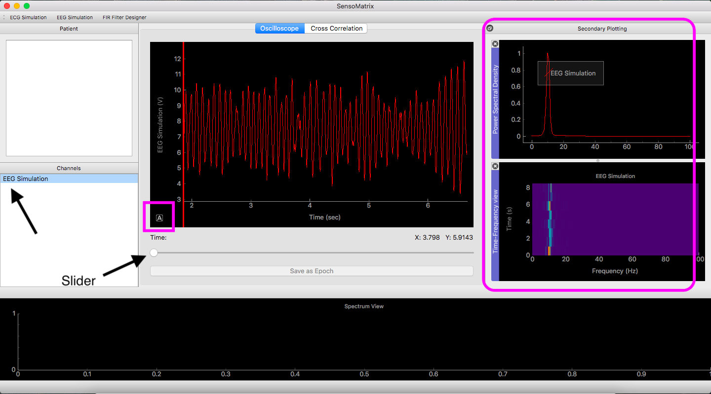

# Visualizing the data

The application can be used to work with a single channel signal or a multichannel
signal.

## Single channel
When working with only one signal.

### Removing DC Component

- To remove the DC component from the signal, under the *Channels* tab, **right-click** on the signal name for which you 
want to remove DC, and click on **Remove DC**.

### Viewing the Power Spectral Density

- Under the *Channels* tab, **right-click** on the signal name for which you 
want to see the power spectral density (PSD). 
- Click on **Plot PSD** and the PSD of the signal will appear under the 
*Secondary plotting* tab.

### Viewing the Time-Frequency Plot

- Under the *Channels* tab, **right-click** on the signal name for which you 
want to see the time-frequency plot.
- Click on **Plot Time-Frequency** and the time-frequency plot will appear under
the *Secondary plotting* tab. 

### Moving & Zooming 

- To **move** the signal, *click* and *drag* the signal.
- To zoom in & out of the signal, *scroll up & down* on the signal.

### Using the slider

The slider at the bottom of the Oscilloscope can be used to take a closer look at the signal.
In order to see the complete signal again, hover your mouse over the bottom left corner
of the axis (shown in blue in the image below) and when a small ```A``` appears, click on it.
 

## Multichannel
When for example, one file has more than one signal, then each of the following
can be done on each signal separately (except the slider and *Moving & Zooming*, which moves all signals together).

### Removing DC Component
Follow the same steps as under single channel.

### Viewing the Power Spectral Density
Follow the same steps as under single channel.

### Viewing the Time-Frequency Plot
Follow the same steps as under single channel.

### Using the slider
Follow the same steps as under single channel.
